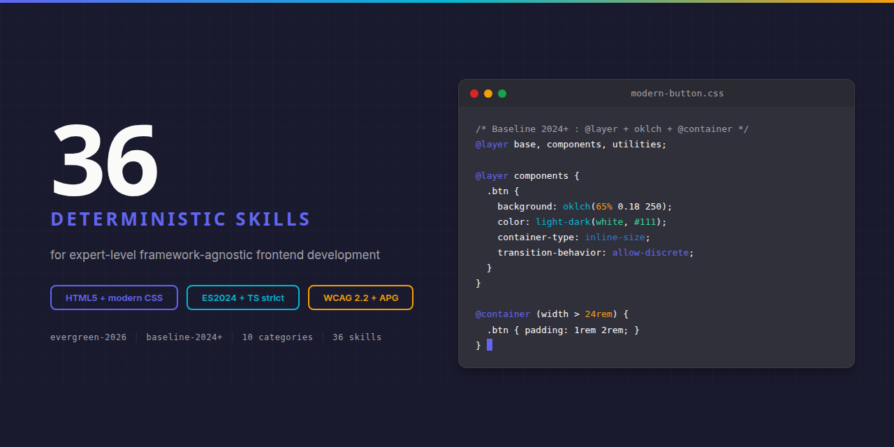

# Frontend Design : Claude Skill Package

<p align="center">
  
</p>


**36 deterministic Claude skills for framework-agnostic modern frontend design.** HTML5, modern CSS (Cascade Layers, container queries, `:has()`, `color-mix`/OKLCH, subgrid, native nesting, View Transitions, Popover API, anchor positioning), JavaScript ES2024, TypeScript strict, Web APIs, WCAG 2.2, Core Web Vitals. Target baseline : `evergreen-2026`.

Built on the [Agent Skills](https://agentskills.org) open standard. Discoverable via npm-agentskills manifest and OpenAI Codex skill discovery.

## Why This Exists

Without skills, Claude tends to produce generic AI-looking frontends : rounded-md gray cards, default Inter/Geist fonts, hsl-based palettes that fail at perceptual lightness, JS recreations of native widgets, and animation patterns that fail Core Web Vitals INP. Without WebFetch verification, claims drift from spec.

With this skill package, Claude follows research-first, WebFetch-verified, deterministic patterns :

```css
/* generic (avoid)                       /* distinctive + accessible */
.card {                                   .card {
  border-radius: 8px;                       border-radius: var(--radius-card);
  background: #f5f5f5;                      background: light-dark(
  padding: 24px;                              oklch(98% 0.01 var(--brand-h)),
}                                             oklch(20% 0.02 var(--brand-h))
                                            );
                                            container-type: inline-size;
                                            padding: var(--space-card);
                                          }

                                          @container (width > 36rem) {
                                            .card { /* responsive intrinsics */ }
                                          }
```

## What is Inside

| Category | Count | Purpose |
|----------|:-----:|---------|
| **frontend-core/** | 3 | Architecture, web standards, design philosophy |
| **frontend-syntax/** | 9 | HTML5 / modern CSS / JS ES2024 / TS strict |
| **frontend-impl/** | 6 | Design tokens, responsive layout, typography, popover/dialog/anchor, view transitions, web components |
| **frontend-errors/** | 4 | Cascade conflicts, layout pitfalls, viewport units, animation jank |
| **frontend-theming/** | 2 | OKLCH palette generation, dark/light mode |
| **frontend-visual/** | 3 | Glassmorphism, gradients, micro-interactions |
| **frontend-a11y/** | 3 | ARIA APG patterns, focus + keyboard + inert, motion + contrast + WCAG 2.2 |
| **frontend-perf/** | 2 | Core Web Vitals + INP, GPU + containment |
| **frontend-component/** | 2 | Modal/toast system, data tables + command palette |
| **frontend-agents/** | 2 | Design-system validator, a11y/perf/consistency auditor |
| **Total** | **36** | |

See [INDEX.md](INDEX.md) for the complete skill catalog with paths and dependency graph.

## Research foundation

Every skill is built on research-first methodology :

- [Vooronderzoek](docs/research/vooronderzoek-frontend.md) : 7,545 words, 41 WebFetch verifications
- [Topic research](docs/research/topic-research/) : 11 files, ~40,000 words, 200+ verifications
- Total research corpus : ~47,000 words across MDN, W3C, WAI, web.dev, WHATWG, designtokens.org, Open UI

Every code snippet, property name, API signature, and behavior claim is WebFetch-verified against an approved source listed in [SOURCES.md](SOURCES.md).

## Installation

### Claude Code (recommended)

```bash
git clone https://github.com/OpenAEC-Foundation/Frontend-Design-Claude-Skill-Package.git
cp -r Frontend-Design-Claude-Skill-Package/skills/source/ ~/.claude/skills/frontend/
```

### As git submodule

```bash
git submodule add https://github.com/OpenAEC-Foundation/Frontend-Design-Claude-Skill-Package.git .claude/skills/frontend
```

### Via npm-agentskills standard

```bash
npx skills add @openaec/frontend-claude-skill-package
```

### Claude.ai (web)

Upload individual SKILL.md files as project knowledge.

## Skill structure

Every skill follows 3-level progressive disclosure :

```
frontend-{category}/frontend-{category}-{topic}/
  SKILL.md              # Main guidance, max 500 lines
  references/
    methods.md          # Complete API signatures, property tables
    examples.md         # Working code examples (HTML/CSS/JS)
    anti-patterns.md    # What NOT to do, with symptom + root cause + fix
```

YAML frontmatter uses folded scalar `>`, "Use when..." opener, and a `Keywords:` line mixing technical + symptom-based + plain-language terms for maximum discoverability.

## Scope

**In scope** : HTML5, CSS, JavaScript ES2024, TypeScript strict, Web APIs (Popover, Dialog, View Transitions, IntersectionObserver, ResizeObserver, Web Components), WCAG 2.2, ARIA 1.2 Authoring Practices, Core Web Vitals.

**Out of scope** : framework-specific code (React, Vue, Solid, Svelte, Angular, Qwik). Framework integration belongs in companion packages.

## Quality guarantees

- **Deterministic language** : ALWAYS / NEVER, no "you might consider"
- **Version-explicit** : Baseline status annotated per feature (Limited / Newly / Widely Available)
- **WebFetch-verified** : every claim traceable to an approved source
- **5 validators green** : frontmatter / line-count / structure / language / em-dash
- **Compliance audit** : 100% score (4/4 checks passed)

## Companion Skills : Cross-Technology Integration

For projects combining Frontend Design with other AEC technologies, see [Cross-Tech-AEC-Claude-Skill-Package](https://github.com/OpenAEC-Foundation/Cross-Tech-AEC-Claude-Skill-Package).

## Related Skill Packages (OpenAEC Foundation)

| Package | Skills | Repo |
|---------|--------|------|
| Blender-Bonsai-ifcOpenshell-Sverchok | 73 | [Link](https://github.com/OpenAEC-Foundation/Blender-Bonsai-ifcOpenshell-Sverchok-Claude-Skill-Package) |
| Frappe | 61 | [Link](https://github.com/OpenAEC-Foundation/Frappe_Claude_Skill_Package) |
| Speckle | 25 | [Link](https://github.com/OpenAEC-Foundation/Speckle-Claude-Skill-Package) |
| Tauri 2 | 27 | [Link](https://github.com/OpenAEC-Foundation/Tauri-2-Claude-Skill-Package) |
| n8n | 21 | [Link](https://github.com/OpenAEC-Foundation/n8n-Claude-Skill-Package) |

See full list at [OpenAEC-Foundation](https://github.com/OpenAEC-Foundation).

## License

MIT : OpenAEC Foundation. See [LICENSE](LICENSE).

## Contributing

See [CONTRIBUTING.md](CONTRIBUTING.md). Built with the [Skill Package Workflow Template](https://github.com/OpenAEC-Foundation/Skill-Package-Workflow-Template) methodology.
